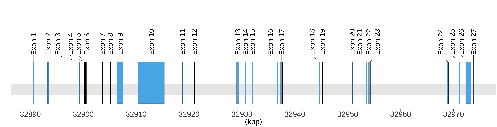

# exonR

exonR is an R package for generating beautiful and customizable plots for the exons and introns of any gene.

If you find any bugs, have any feature requests or feedback, please submit an issue.

To download and install the development version of the package, use `devtools`:
```
install.packages("devtools")
devtools::install_github("BatoolMM/exonR")
```
Once you've installed the package, you can load the library in the standard way:

```
library(exonR)
```
Basic usage:
```
BRCA2 <- find_exons("NM_000059")
BRCA2
 chromosome/scaffold_name exon_region_start__bp_ exon_region_end__bp_
1                        13               32890559             32890664
2                        13               32893214             32893462
3                        13               32899213             32899321
   5'_utr_start 5'_utr_end 3'_utr_start 3'_utr_end exon_length
1      32890559   32890597           NA         NA         105
2            NA         NA           NA         NA         248
3            NA         NA           NA         NA         108

graph <- plot_exons(BRCA2, BRCA2$exon_region_start__bp_, BRCA2$exon_region_end__bp_)
```
<p align="center">
  
</p>
